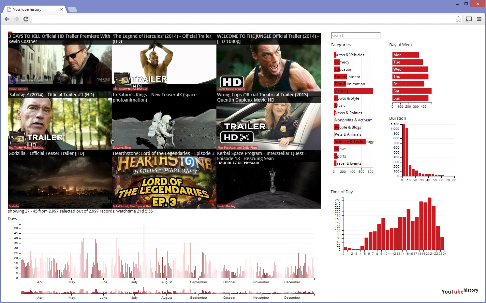

Youtube History Visualization
=============================

Personal Youtube history visualization with d3.js dc.js and crossfilter.js

Workflow
--------

[src/ch/fritscher/YoutubeHistoryV3.groovy](src/ch/fritscher/YoutubeHistoryV3.groovy) parses data from personal youtube v3 api into database.
[api.groovy](api.groovy) generates a json file like shown in [api_sample_output.json](api_sample_output.json), which is used by dc.js/crossfilter to generate interactive d3.js charts.

Screenshot
----------
